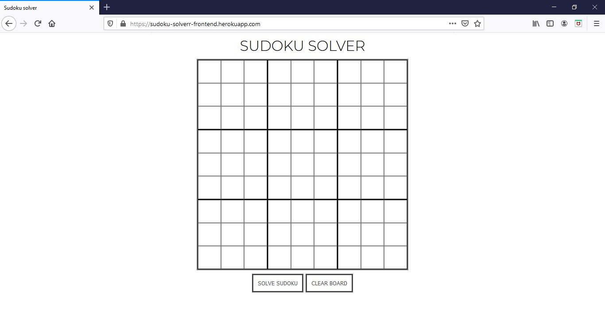
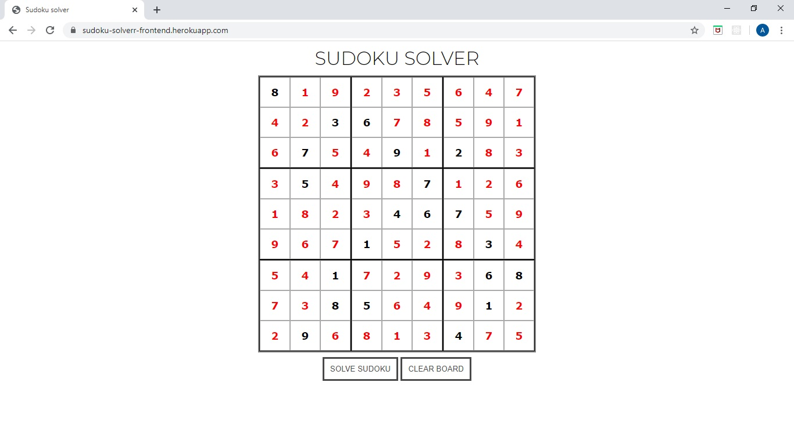

# Sudoku solver website
Frontend Sudoku Solver (HTML, CSS, JavaScript). 
Simple website that will you solve even the most difficult sudoku.

See also Backend Sudoku Solver API [https://github.com/PawelM-code/Sudoku-solver](https://github.com/PawelM-code/Sudoku-solver) 

## Demo running on Heroku
On Heroku you can find a deployed version. [https://sudoku-solverr-frontend.herokuapp.com/](https://sudoku-solverr-frontend.herokuapp.com/)

## Technologies
Project is created with:
* HTML
* CSS
* JavaScript

## Screenshot

